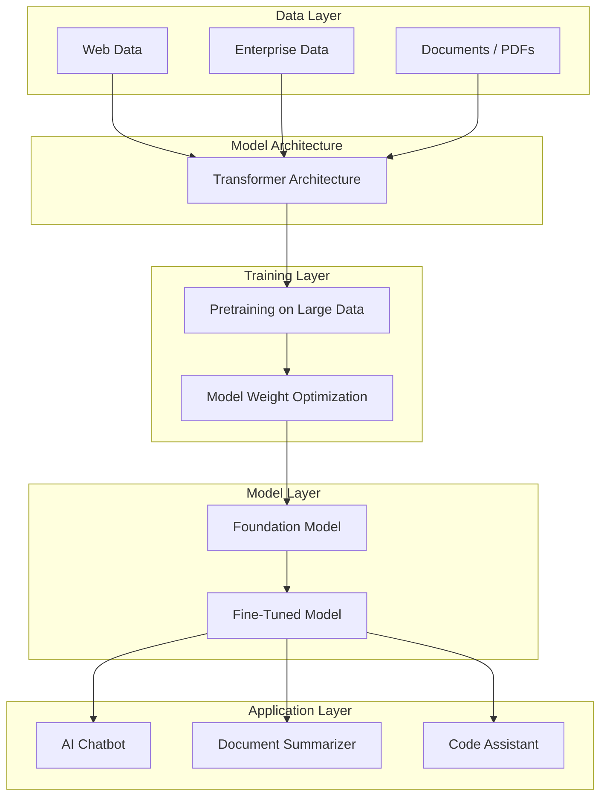
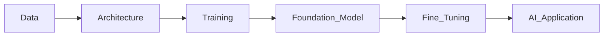
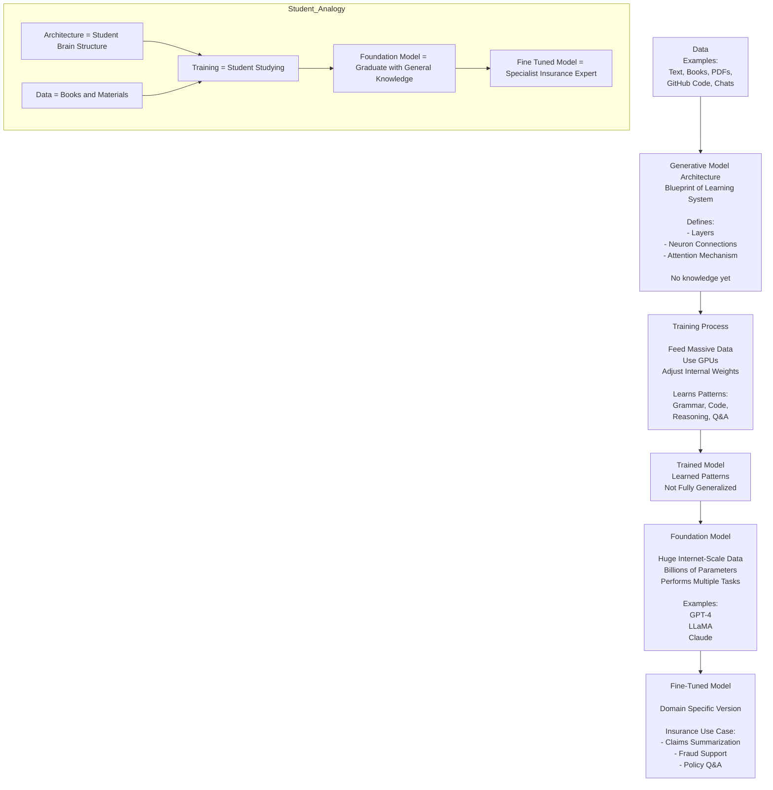

```mermaid
flowchart TD

    subgraph Data Layer
        A1[Web Data]
        A2[Enterprise Data]
        A3[Documents / PDFs]
    end

    subgraph Model Architecture
        B1[Transformer Architecture]
    end

    subgraph Training Layer
        C1[Pretraining on Large Data]
        C2[Model Weight Optimization]
    end

    subgraph Model Layer
        D1[Foundation Model]
        D2[Fine-Tuned Model]
    end

    subgraph Application Layer
        E1[AI Chatbot]
        E2[Document Summarizer]
        E3[Code Assistant]
    end

    A1 --> B1
    A2 --> B1
    A3 --> B1

    B1 --> C1
    C1 --> C2
    C2 --> D1
    D1 --> D2
    D2 --> E1
    D2 --> E2
    D2 --> E3
```

```mermaid
flowchart LR
    Data --> Architecture
    Architecture --> Training
    Training --> Foundation_Model
    Foundation_Model --> Fine_Tuning
    Fine_Tuning --> AI_Application
```

```mermaid
flowchart TD

%% =========================
%% MAIN GEN AI FLOW
%% =========================

A[Data<br>Examples:<br>Text, Books, PDFs,<br>GitHub Code, Chats]

B[Generative Model Architecture<br>Blueprint of Learning System<br><br>Defines:<br>- Layers<br>- Neuron Connections<br>- Attention Mechanism<br><br>No knowledge yet]

C[Training Process<br><br>Feed Massive Data<br>Use GPUs<br>Adjust Internal Weights<br><br>Learns Patterns:<br>Grammar, Code,<br>Reasoning, Q&A]

D[Trained Model<br>Learned Patterns<br>Not Fully Generalized]

E[Foundation Model<br><br>Huge Internet-Scale Data<br>Billions of Parameters<br>Performs Multiple Tasks<br><br>Examples:<br>GPT-4<br>LLaMA<br>Claude]

F[Fine-Tuned Model<br><br>Domain Specific Version<br><br>Insurance Use Case:<br>- Claims Summarization<br>- Fraud Support<br>- Policy Q&A]

A --> B
B --> C
C --> D
D --> E
E --> F

%% =========================
%% STUDENT ANALOGY
%% =========================

subgraph Student_Analogy

S1[Architecture = Student Brain Structure]
S2[Data = Books and Materials]
S3[Training = Student Studying]
S4[Foundation Model = Graduate with General Knowledge]
S5[Fine Tuned Model = Specialist Insurance Expert]

S1 --> S3
S2 --> S3
S3 --> S4
S4 --> S5

end
```
