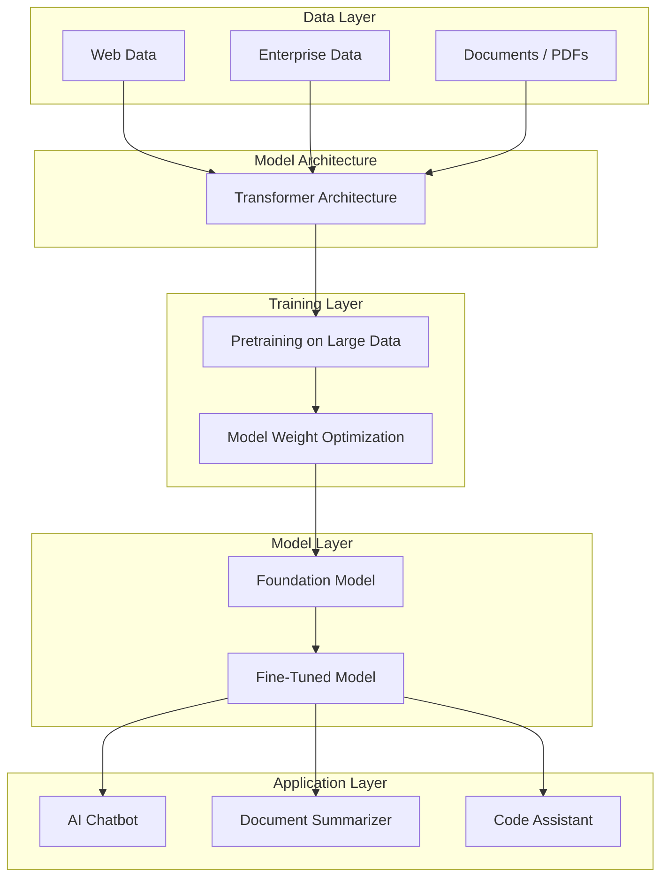
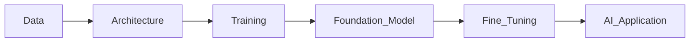

```mermaid
flowchart TD

%% =========================
%% MAIN GEN AI FLOW
%% =========================

A[Data<br><br>Examples:<br>• Text from websites<br>• Books<br>• PDFs<br>• GitHub code<br>• Chat conversations]

B[Generative Model Architecture<br><br>Blueprint of learning system<br><br>Defines:<br>• Number of layers<br>• Neuron connections<br>• Attention mechanism<br><br>❌ No knowledge yet<br>❌ Cannot answer questions]

C[Training Process<br><br>• Feed massive data<br>• Use GPUs<br>• Adjust internal weights<br><br>Model starts learning patterns:<br>• Grammar<br>• Code structure<br>• Logical reasoning<br>• Q&A format]

D[Trained Model<br><br>Has learned patterns<br>But not fully generalized]

E[Foundation Model<br><br>• Trained on huge internet-scale data<br>• Billions of parameters<br>• Can perform multiple tasks<br><br>Base model for many use cases<br><br>Examples:<br>GPT-4<br>LLaMA<br>Claude]

F[Fine-Tuned Model<br><br>Customized for domain-specific tasks<br><br>Example: Insurance Use Case<br>• Claims summarization<br>• Fraud detection support<br>• Policy Q&A assistant<br><br>Foundation Model + Company Data]

A --> B
B --> C
C --> D
D --> E
E --> F


%% =========================
%% ANALOGY SECTION
%% =========================

subgraph Student_Analogy

S1[Architecture<br>= Student's brain structure]

S2[Data<br>= Books & materials]

S3[Training<br>= Student studying]

S4[Foundation Model<br>= Graduate with general knowledge]

S5[Fine-Tuned Model<br>= Specialist (Insurance Expert)]

S1 --> S3
S2 --> S3
S3 --> S4
S4 --> S5

end
```
