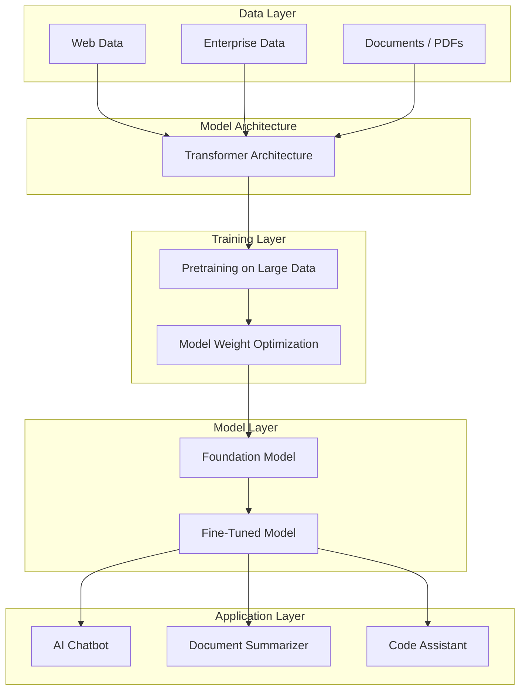

```mermaid
flowchart TD

    subgraph Data Layer
        A1[Web Data]
        A2[Enterprise Data]
        A3[Documents / PDFs]
    end

    subgraph Model Architecture
        B1[Transformer Architecture]
    end

    subgraph Training Layer
        C1[Pretraining on Large Data]
        C2[Model Weight Optimization]
    end

    subgraph Model Layer
        D1[Foundation Model]
        D2[Fine-Tuned Model]
    end

    subgraph Application Layer
        E1[AI Chatbot]
        E2[Document Summarizer]
        E3[Code Assistant]
    end

    A1 --> B1
    A2 --> B1
    A3 --> B1

    B1 --> C1
    C1 --> C2
    C2 --> D1
    D1 --> D2
    D2 --> E1
    D2 --> E2
    D2 --> E3
```
